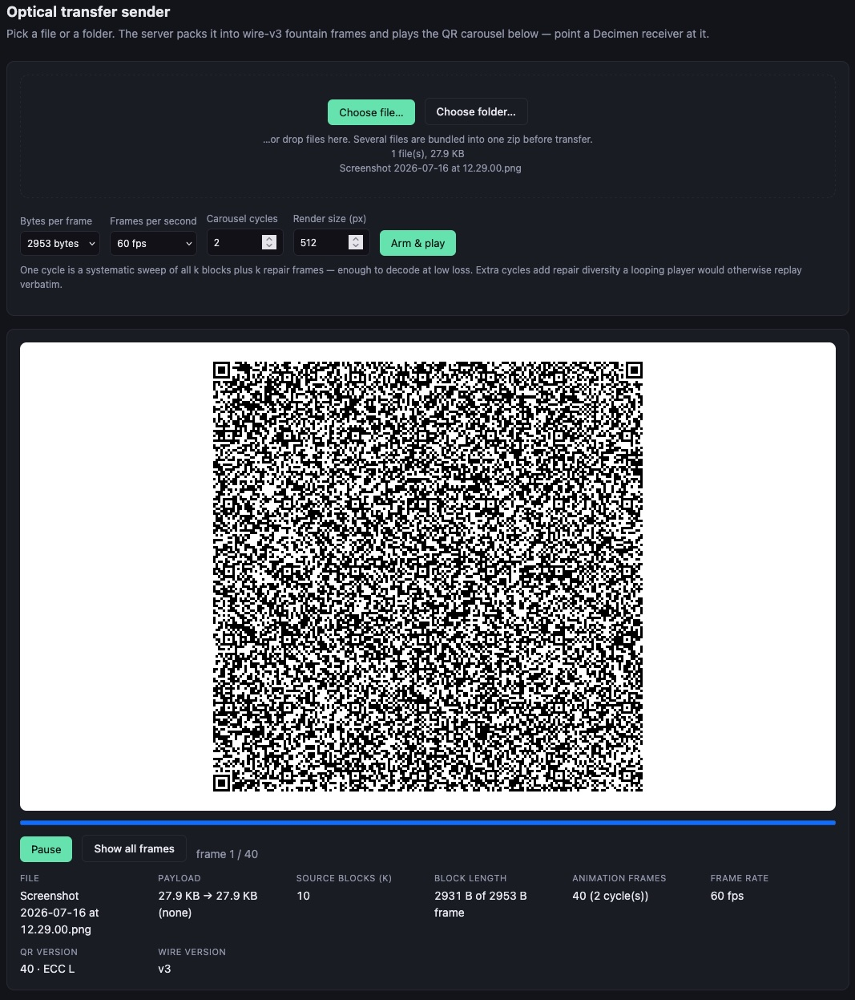

# go-decimen-optical-transfer

Golang port for server part from [bashalarmistalt/decimen-optical-transfer](https://github.com/bashalarmistalt/decimen-optical-transfer)



A Go web app that turns a file or a folder into a QR code carousel a camera can
read. It is the **sending** half of [bashalarmistalt/decimen-optical-transfer](https://github.com/bashalarmistalt/decimen-optical-transfer),
ported from that app's TypeScript `shared/` modules to Go and served over HTTP instead of run on the desktop.

Frames are byte-identical to what the original sender emits (wire format v3), so
a Decimen receiver — or any client holding to the same golden vectors — decodes
what this server renders.

```
go test ./...
go run . -addr :8080
```

Then open http://localhost:8080, pick a file or a folder, and point a receiver at
the animation.

## Why

Well, since it's airgap, running the original repo in that is a pain. So I think a single binary file would be nice, and I am good with go so.
Rust would be ok too but I must admit I am not very good with Rust.

## What was ported

| This repo           | Original                                                                                                                       |
| ------------------- | ------------------------------------------------------------------------------------------------------------------------------ |
| `internal/protocol` | `shared/protocol.ts` — 22-byte frame header, DCF2 container, FNV-1a, splitmix32                                                |
| `internal/fountain` | `shared/fountain.ts` — systematic-carousel fountain code, encoder and decoder                                                  |
| `internal/session`  | `shared/frame-capacity.ts`, `shared/send-settings.ts`, `send/export.ts` — sizing, tuning, finite render of an endless carousel |
| `internal/qrgen`    | `send/qr-frame.ts`, `shared/qr-raster.ts` — one QR path, ECC L, version locked by the first frame                              |

Not ported: the receiver, the PWA shell, localization, APNG/ZIP export, and the
multi-code grid layout. One QR per animation frame.

## How a transfer works

A screen-to-camera link has no back-channel, so there is no handshake and no
retransmission. Instead:

1. The file is wrapped in a **container** carrying its name, media type, gzip
   flag (applied only when it shrinks the payload) and the SHA-256 of the
   original bytes. A folder becomes one zip first — the wire carries exactly one
   container.
2. The container is split into `k` source blocks of `frameBytes - 22` bytes.
3. The sender emits an endless **carousel**: a systematic sweep of all `k`
   blocks, then `k` mid-degree repair frames (XORs of pseudorandom block
   subsets derived from the frame's sequence number), then the next cycle.
4. Every frame is **self-describing** — 22 bytes of header naming the wire
   version, flags, session id, sequence, block count and size, total length and
   the container's FNV-1a. A receiver locks on mid-flight.

A receiver that catches a whole sweep completes in exactly `k` frames. Dropped
frames cost a little time, never correctness.

## API

| Route                               | Returns                                                                                          |
| ----------------------------------- | ------------------------------------------------------------------------------------------------ |
| `GET /`                             | the player UI                                                                                    |
| `GET /api/options`                  | frame-size and fps lists, defaults, limits                                                       |
| `POST /api/arm`                     | multipart `files` + parallel `paths`, plus `frameBytes`, `fps`, `cycles`, `scale` → session JSON |
| `GET /api/sessions/{id}`            | session JSON                                                                                     |
| `GET /api/sessions/{id}/frames/{n}` | frame `n` as a PNG                                                                               |
| `GET /api/sessions/{id}/wire/{n}`   | frame `n` as raw wire bytes                                                                      |

`paths` is separate from the file part because Go's multipart reader strips
directories from the filename field; it is the only way a folder pick keeps its
tree. Sessions live in memory and expire after `-ttl` (default 2h).

The wire endpoint exists so another implementation can be checked against this
one without a camera.

## Tuning

`frameBytes` (500…2953) trades QR density against how much each frame carries.
`k` is a u16 in the header, so a large payload at a small frame size runs out of
block numbers long before it runs out of the 64 MB file limit — at 500 bytes per
frame the real ceiling is about 31 MB. The server catches that before streaming
and names the setting that fixes it.

On a 60 Hz display a frame needs ≥2 refresh cycles to be caught reliably, so 60
fps is the wrong default there despite being the listed one; 24–30 fps is the
setting to walk down to when a receiver shows no signal.

`cycles` is how much of the endless carousel gets rendered. One cycle decodes at
low loss; extra cycles add repair diversity a looping player would otherwise
replay verbatim.

## Wire format conformance

`internal/fountain/testdata/` holds golden vectors generated by running the
_original_ TypeScript functions under Node — spliced out of `fountain.ts`
verbatim, not re-typed. `internal/protocol` pins the canonical frame from the
upstream `docs/technical/golden-vectors.md`. Sender and receiver derive block
subsets independently and never compare notes, so a drift in either is a silent,
total failure; the tests exist to make it loud.

`internal/session` decodes the actual PNGs with gozxing and drives a session's
own frames back through the fountain decoder — the only check that catches a
header field read from the wrong offset, since per-layer tests pass happily when
pack and parse agree with each other but not with the wire.

# code status

```shell
 scc
───────────────────────────────────────────────────────────────────────────────
Language            Files       Lines    Blanks  Comments       Code Complexity
───────────────────────────────────────────────────────────────────────────────
Go                     12       2,127       170       238      1,719        434
Markdown                2         106        23         0         83          0
Plain Text              2          79         0         0         79          0
HTML                    1         268        16         0        252          0
───────────────────────────────────────────────────────────────────────────────
Total                  17       2,580       209       238      2,133        434
───────────────────────────────────────────────────────────────────────────────
```
